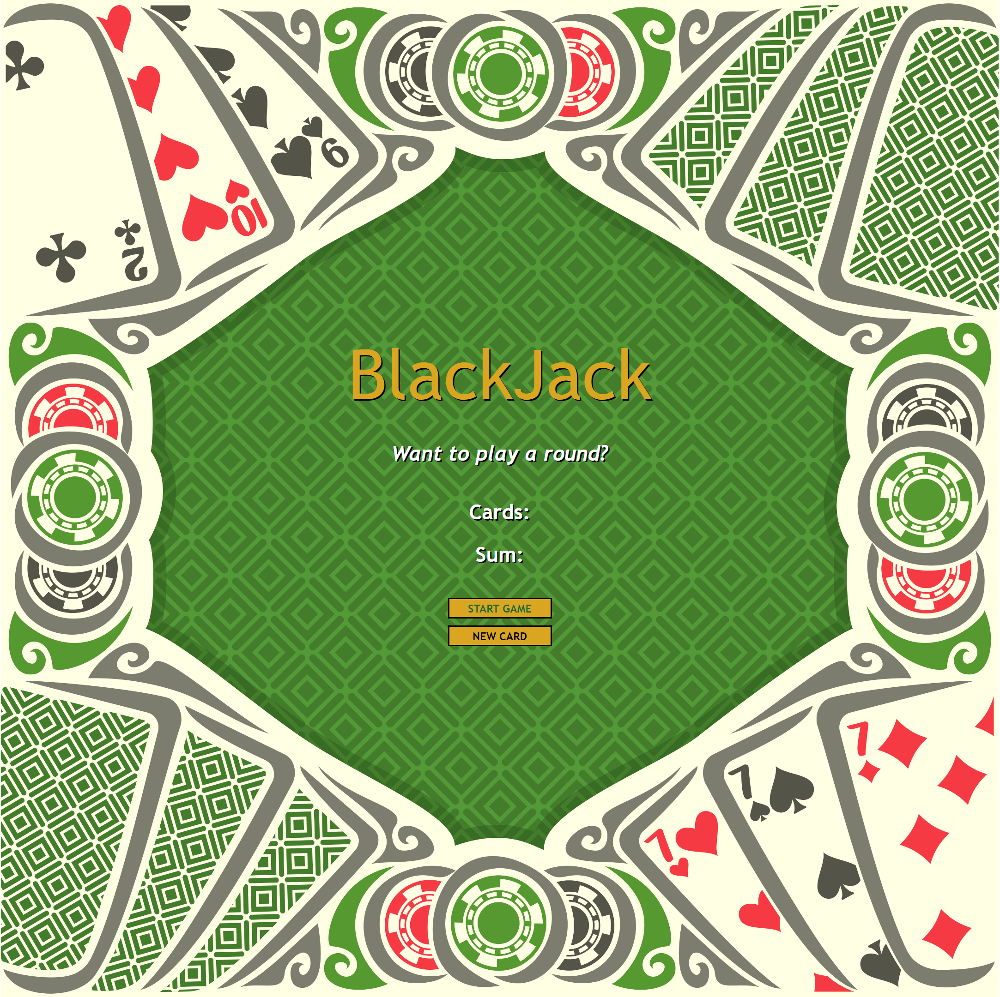

# Simple-Black-Jack-Javascript
Very simple Black Jack game utilizing JavaScript, HTML, CSS 


## Installation
```sh
Download folder and open index.html, use mouse click START GAME to begin and click on NEW CARD for new card.
Game will stop when you get a black jack or go over 21, click on START GAME for a new game.
```

